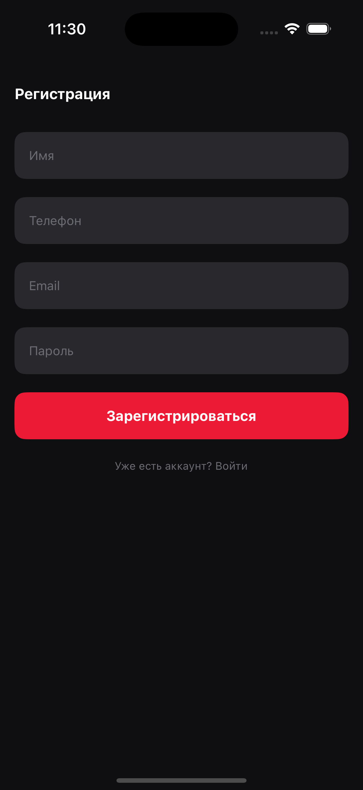
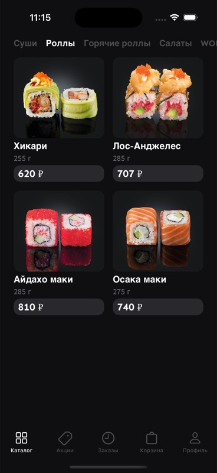
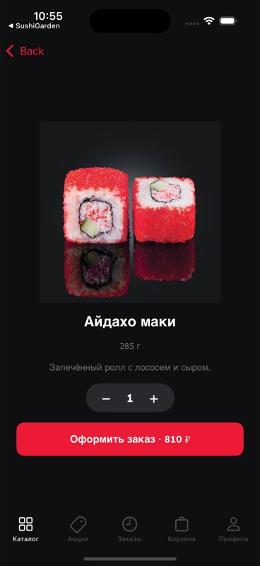

# SushiGarden

A UIKit sushi delivery app for iOS 17, built with MVVM-C, Combine, and no storyboards.

## Screens

| Login | Register |
|-------|----------|
|  |  |

| Catalog | Product Detail |
|---------|----------------|
|  |  |

## Architecture

- **Pattern:** MVVM-C (Model–View–ViewModel–Coordinator)
- **UI:** UIKit, programmatic layout — no storyboards or XIBs
- **Reactive:** Combine (`@Published`, `AnyCancellable`)
- **DI:** `AppContainer` passed through the coordinator tree
- **Navigation:** Coordinator pattern; each feature owns its `UINavigationController`

## Tech Stack

- Swift 5.9 · iOS 17
- UIKit · Combine
- XcodeGen (`project.yml`)
- 96 unit tests

## Project Structure

```
Project/
├── Core/
│   ├── Coordinator/     # AppCoordinator, Coordinator protocol
│   ├── DI/              # AppContainer
│   └── Models/          # Domain models (Product, Category, UserProfile, CartItem)
├── Services/
│   ├── Auth/            # InMemoryAuthService
│   ├── Catalog/         # InMemoryCatalogService
│   └── Cart/            # InMemoryCartService
├── Features/
│   ├── Auth/            # Splash, Login, Register
│   └── Main/
│       └── Catalog/     # CatalogViewController, ProductDetailViewController
└── DesignSystem/        # Colors, fonts, spacing, reusable components
```
