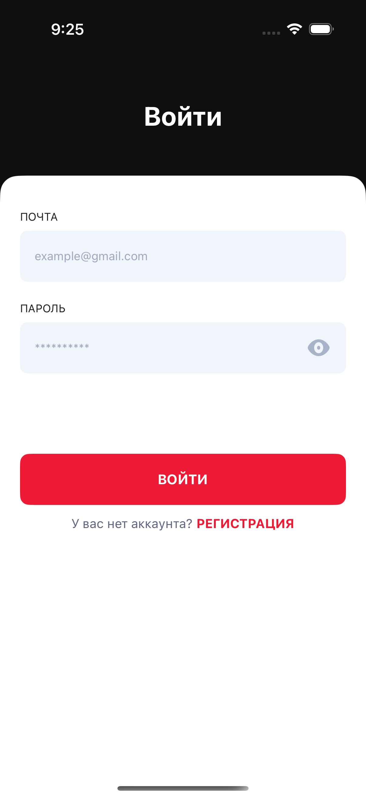
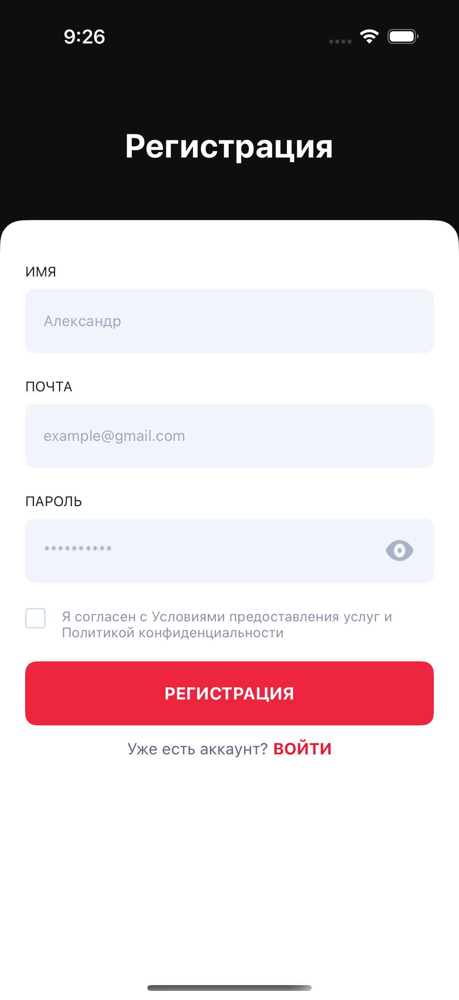
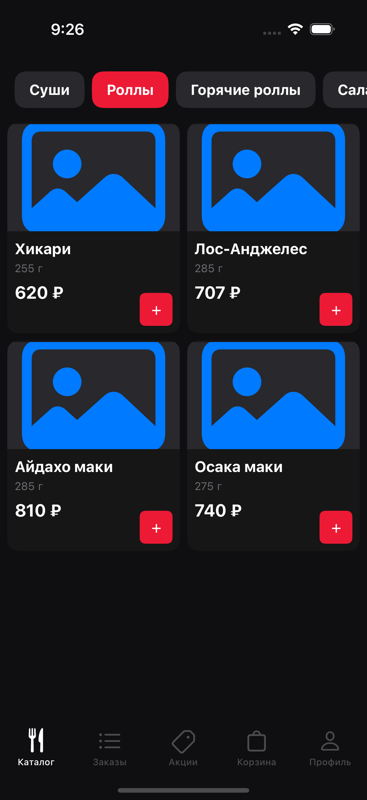
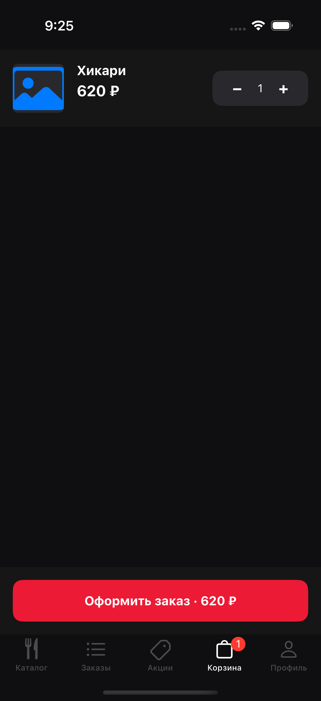
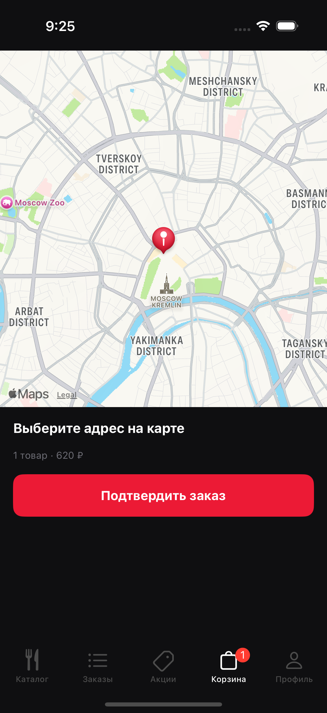

# Sushi Garden UIKit

A Russian-language sushi delivery app built in Swift for iOS 17+, using UIKit with the MVVM-C coordinator pattern, programmatic layout throughout, and zero storyboards.

---

## Screenshots

| Login | Register | Catalog |
|-------|----------|---------|
|  |  |  |

| Cart (empty) | Cart (filled) | Checkout |
|--------------|---------------|----------|
|  |  |  |

| Orders | Promotions | Profile |
|--------|------------|---------|
|  |  |  |

---

## Tech Stack

| Layer | Technology |
|-------|------------|
| UI | UIKit (iOS 17), programmatic layout |
| Architecture | MVVM-C (coordinator pattern) |
| Reactive | Combine (`@Published`, `AnyCancellable`) |
| Auth | `InMemoryAuthService` (seeded account) |
| Persistence | In-memory services (cart, orders, catalog) |
| Project | XcodeGen (`project.yml`) |
| Tests | XCTest (unit) + XCUITest (UI) |

---

## Architecture

### Layer overview

```
┌──────────────────────────────────────────────────┐
│                      App                         │
│   AppDelegate → SceneDelegate → UIWindow         │
│                      ↓                           │
│             AppContainer (DI root)               │
│     auth │ catalog │ cart │ orders │ promotions  │
└─────────────────────┬────────────────────────────┘
                      │ injected through coordinator tree
             ┌────────┴────────┐
             │  AppCoordinator  │
             └────────┬────────┘
                      │
          ┌───────────┴───────────┐
          │                       │
   AuthCoordinator        MainTabCoordinator
   (unauthenticated)       (authenticated)
          │                       │
  SplashViewController    5 tab coordinators
  LoginViewController     CatalogCoordinator
  RegisterViewController  CartCoordinator
                          OrdersCoordinator
                          PromotionsCoordinator
                          ProfileCoordinator
```

### MVVM-C per feature

```
ViewController  ──binds──▶  ViewModel
     │                          │
     │  (Combine sink)     Service layer
     │                ┌─────────┼──────────────┐
     │          AuthServicing CartServicing  OrdersServicing
     │          (protocol)   (protocol)     (protocol)
     │                │
     └── Coordinator (owns navigation, creates VC + VM, wires callbacks)
```

### Authentication flow

```
App launch
    │
    ├─ auth.isAuthenticated ──▶ MainTabCoordinator (main app)
    │
    └─ false ──▶ AuthCoordinator
                      │
                      └─ SplashViewController (1.5s delay, skipped in UI tests)
                                │
                          LoginViewController  ◀──▶  RegisterViewController
                                │                           │
                          LoginViewModel             RegisterViewModel
                                │                           │
                           InMemoryAuthService (validates email + password)
                                │
                          onLoginSuccess() ──▶ AppCoordinator replaces root
```

### Coordinator flow

```
AppCoordinator
    │  auth state change (Combine)
    ├─ isAuthenticated = true
    │      childCoordinators.removeAll()
    │      MainTabCoordinator.start()
    │
    └─ isAuthenticated = false
           childCoordinators.removeAll()
           AuthCoordinator.start()

MainTabCoordinator
    ├─ tab 0: CatalogCoordinator  →  CatalogVC  →  ProductDetailVC (push)
    ├─ tab 1: PromotionsCoordinator  →  PromotionsVC
    ├─ tab 2: CartCoordinator  →  CartVC  →  CheckoutVC (present modally)
    ├─ tab 3: OrdersCoordinator  →  OrdersVC
    └─ tab 4: ProfileCoordinator  →  ProfileVC
```

### Test strategy

```
Unit tests (147)                      UI tests (57)
─────────────────────────────────     ───────────────────────────
Services: Auth, Cart, Catalog,        AuthUITests
          Orders                      CatalogUITests
Models: CartItem                      ProductDetailUITests
ViewModels: Login, Register,          CartUITests
            Catalog, ProductDetail,   CheckoutUITests
            Cart, Checkout,           OrdersUITests
            Orders, Profile           PromotionsUITests
ViewControllers: all features         ProfileUITests
Coordinators: all coordinators        TabsUITests
DesignSystem: all components          SmokeUITests

              ↑                                ↑
     Real in-memory services         InMemoryAuthService
     no external dependencies        (--uitesting launch arg)
```

---

## Project Structure

```
Project/
├── App/
│   ├── AppDelegate.swift
│   └── SceneDelegate.swift            ← launch-arg flags, root window setup
├── Core/
│   ├── Coordinator/
│   │   ├── Coordinator.swift          ← protocol + addChild/removeChild
│   │   └── AppCoordinator.swift       ← root: auth state → swap root VC
│   └── DI/
│       └── AppContainer.swift         ← dependency injection container
├── DesignSystem/
│   ├── Colors.swift                   ← AppColor palette
│   ├── Typography.swift               ← AppFont (Sen family)
│   ├── Spacing.swift
│   ├── PrimaryButton.swift
│   ├── FormField.swift
│   ├── QuantityStepper.swift
│   ├── ProductCell.swift
│   ├── CategoryTabCell.swift
│   ├── CartItemCell.swift
│   ├── FontLoader.swift
│   └── UIColor+Hex.swift
├── Features/
│   ├── Auth/
│   │   ├── AuthCoordinator.swift
│   │   ├── AuthFormField.swift        ← labeled input with eye toggle + error
│   │   ├── AuthPalette.swift          ← auth screen color constants
│   │   ├── Splash/
│   │   ├── Login/                     ← LoginViewController + LoginViewModel
│   │   └── Register/                  ← RegisterViewController + RegisterViewModel
│   └── Main/
│       ├── MainTabCoordinator.swift
│       ├── Catalog/
│       │   ├── CatalogCoordinator.swift
│       │   ├── CatalogViewController.swift
│       │   ├── CatalogViewModel.swift
│       │   └── ProductDetail/
│       ├── Cart/
│       │   ├── CartCoordinator.swift
│       │   ├── CartViewController.swift
│       │   ├── CartViewModel.swift
│       │   └── Checkout/
│       ├── Orders/
│       ├── Promotions/
│       └── Profile/
├── Models/
│   ├── Product.swift, Category.swift, AddOn.swift
│   ├── CartItem.swift
│   ├── Order.swift, Promotion.swift
│   └── UserProfile.swift, DeliveryAddress.swift
└── Services/
    ├── Auth/        AuthServicing protocol, InMemoryAuthService
    ├── Catalog/     CatalogServicing protocol, seeded products
    ├── Cart/        CartServicing protocol
    ├── Orders/      OrdersServicing protocol, InMemoryOrdersService
    └── Validation/  FieldValidators (email, password, non-empty)

Tests/                ← unit test target (mirrors Project/ structure)
UITests/
├── Helpers/
│   ├── AX.swift                       ← all accessibility identifiers
│   └── XCUIApplication+Helpers.swift  ← makeAuthenticated/makeUnauthenticated
└── *UITests.swift                     ← one file per feature
```

---

## Setup

### Prerequisites

- Xcode 16+, iOS 17 simulator
- [XcodeGen](https://github.com/yonaskolb/XcodeGen): `brew install xcodegen`

### Steps

```bash
git clone <repo>
cd sushi-garden-uikit

# Add required files (not in repo):
#   Project/Resources/Fonts/Mugesta.ttf   ← licensed display font

xcodegen generate          # regenerates SushiGarden.xcodeproj
open SushiGarden.xcodeproj
```

> **Without `Mugesta.ttf`** the app still launches — titles fall back to system font. Obtain the font file separately and place it at `Project/Resources/Fonts/Mugesta.ttf`, then re-run `xcodegen generate`.

### Seeded account

The app ships with one pre-registered account for testing:

| Email | Password |
|-------|----------|
| `test@sushi.ru` | `secret1` |

### Launch arguments

| Argument | Effect |
|----------|--------|
| `--uitesting` | Skips splash animation; uses `InMemoryAuthService` |
| `--uitesting-authenticated` | Auto-logs in as `test@sushi.ru` on launch |

Both are combined in UI tests via `XCUIApplication.makeAuthenticated()` / `makeUnauthenticated()`.

---

## Running Tests

```bash
# All tests (unit + UI)
xcodebuild test \
  -project SushiGarden.xcodeproj \
  -scheme SushiGarden \
  -destination "platform=iOS Simulator,name=iPhone 16 Pro"

# Unit tests only
xcodebuild test \
  -project SushiGarden.xcodeproj \
  -scheme SushiGarden \
  -only-testing:SushiGardenTests \
  -destination "platform=iOS Simulator,name=iPhone 16 Pro"

# UI tests only
xcodebuild test \
  -project SushiGarden.xcodeproj \
  -scheme SushiGarden \
  -only-testing:SushiGardenUITests \
  -destination "platform=iOS Simulator,name=iPhone 16 Pro"
```

All 204 tests pass (147 unit + 57 UI).
